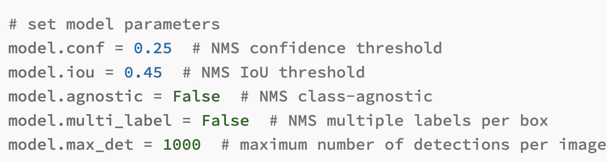

# YOLOv5

## Python Version
The Python version used for operational testing is as follows. If the code doesn't work, try changing it to the version below.
```bash
$ python --version
Python 3.10.4
```

## Install Libraries
Please install the necessary Python libraries using the following command.
```bash
pip install -r requirements.txt
```

## Prepare the model file
To run this sample code, you will need the YOLOv5 model file (.pt file).
Please prepare the model file exported from the FastLabel app.

## Change the config file
[Here](./config/parameters.json) is the model's config file.  
For information on each parameter, please refer to the following page.
 - https://pypi.org/project/yolov5/


Regarding `class_name_and_index`, by default, it is set to the labels of the COCO dataset.
Please change it to the labels of the data you have prepared before using it.

## How to execute the model
Please run the below command to execute the model
```bash
python scripts/inference.py \
--input_data_path <path_to_input_image> \
--model_path <path_to_model_file> \
--conf_file_path <path_to_config_file> \
--output_file_path <path_to_output_file>
```

The actual file path and the example used are as follows.
```bash
python scripts/inference.py \
--input_data_path "input/bus.jpg" \
--model_path "models/yolov5s.pt" \
--conf_file_path "config/parameters.json" \
--output_file_path "output/output.json"
```
